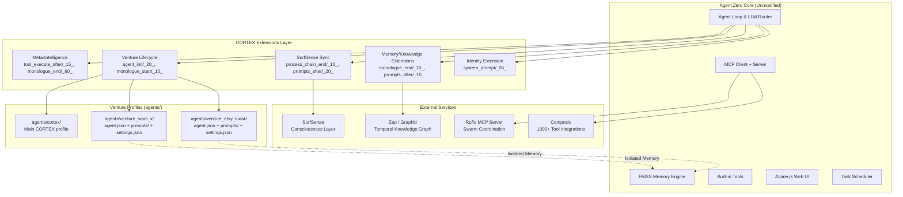
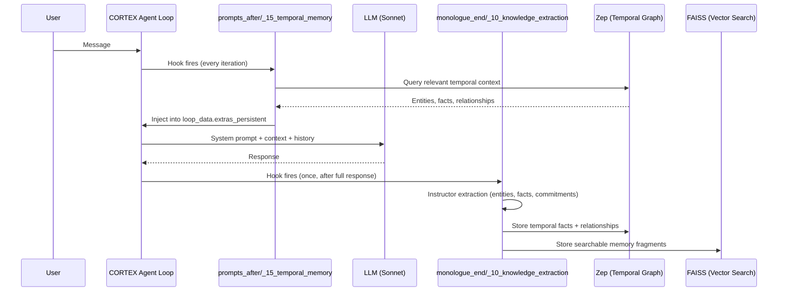
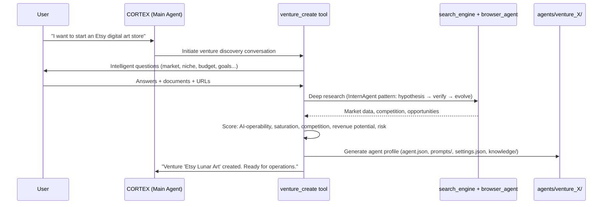

# CORTEX — Refined Implementation Plan (Code-Verified)

**Status:** Plan Finalized — Ready to Build  
**Date:** 2026-03-23  
**Foundation:** Agent Zero fork (`C:\Users\Admin\CORTEX`)  
**Reference:** `C:\Users\Admin\CORTEX-Ruflo` (OMNIS + research docs — DO NOT MODIFY)  
**Verified Against:** Actual Agent Zero source code (all paths, interfaces, hooks confirmed)

---

## 1. Architecture Overview

CORTEX is built **entirely through Agent Zero's extension system** — no core modifications needed. All customization flows through 24 async hook points, per-profile agent configs, and the existing tool/MCP infrastructure.



---

## 2. Critical Corrections from Code Analysis

These corrections override the original `CORTEX_PLAN.md` where it was inaccurate:

### 2a. `_context.md` / `agent.json` Context Field — What It Actually Does

| What the plan assumed | What the code actually does |
|---|---|
| VentureDNA stored in `_context.md`, injected into the venture agent's own system prompt | `_context.md` is backward-compat for `agent.json`'s `context` field. It is read by the **parent/calling agent** via the `call_subordinate` tool prompt (`agent.system.tool.call_sub.md`). It is **NOT** injected into the subordinate's own system prompt. |

**Correct pattern for venture identity:**
- `agent.json` → `context` + `description` fields describe the venture **to the orchestrator** (when should this venture agent be called?)
- `prompts/agent.system.main.role.md` → Defines the venture agent's **own identity, behavior, and VentureDNA** (injected into its system prompt)
- `prompts/agent.system.main.communication.md` → Override communication style per venture
- `settings.json` → Override model, memory subdir, knowledge subdir, MCP servers per venture

### 2b. Extension Hook Mapping Corrections

| CORTEX Feature | Plan's Hook | Correct Hook | Reason |
|---|---|---|---|
| SurfSense context pull | `system_prompt/_20_` | `message_loop_prompts_after/_20_` | `system_prompt/` builds the base prompt list; `prompts_after/` is where recall and context injection actually happens (see `_50_recall_memories.py` pattern) |
| Entity/fact extraction | `message_loop_end/_10_` | `monologue_end/_10_` | `monologue_end/` fires once after the full response, not per-iteration. Built-in `_50_memorize_fragments.py` and `_51_memorize_solutions.py` already show the pattern |
| Venture state loading | `message_loop_start/` | `monologue_start/_10_` | `monologue_start/` fires once at conversation start (before the inner loop). `message_loop_start/` fires every iteration — too frequent for state loading |
| SurfSense push | `process_chain_end/_10_` | `process_chain_end/_10_` ✅ | Correct, but note: `data` kwarg is `{}` (empty). Must read from `self.agent` history directly |

### 2c. UI Strategy Change

| Original plan | Refined approach |
|---|---|
| Phase E: Full Next.js rebuild of all 13 tabs | Extend existing Alpine.js UI progressively during Phases A-D. Each phase adds its own UI components. Next.js deferred to optional "Polish" phase only if Alpine.js hits hard limits |

**Why:** The Alpine.js UI is well-structured (component-based, store-driven, auto-discovered API endpoints). Adding a new settings tab = 1 HTML file + 1 store.js. Adding a new modal = 1 HTML file. No framework rewrite needed.

---

## 3. Extension Interface Reference

Every CORTEX extension follows this exact pattern (verified from `python/helpers/extension.py`):

```python
from python.helpers.extension import Extension

class MyCortexExtension(Extension):
    async def execute(self, **kwargs) -> None:
        # self.agent  → the Agent instance (always available except in 'banners/' hook)
        # **kwargs    → hook-specific arguments (see table below)
        # Return value is ignored. Modify state via:
        #   1. Mutate mutable kwargs in-place (lists, dicts)
        #   2. self.agent.set_data(key, value) / self.agent.get_data(key)
        #   3. self.agent.context.* methods
        pass
```

**Key kwargs per hook used by CORTEX:**

| Hook | Key kwargs | How to use |
|---|---|---|
| `system_prompt/` | `system_prompt: list[str]`, `loop_data` | Append strings to `system_prompt` list |
| `message_loop_prompts_after/` | `loop_data: LoopData` | Set `loop_data.extras_persistent["key"]` to inject into every prompt |
| `monologue_start/` | `loop_data: LoopData` | Read venture state, set `loop_data.extras_persistent` |
| `monologue_end/` | `loop_data: LoopData` | Access `self.agent` history for extraction |
| `tool_execute_before/` | `tool_args: dict`, `tool_name: str` | Log tool usage |
| `tool_execute_after/` | `response: Response`, `tool_name: str` | Record outcomes |
| `process_chain_end/` | `data: dict` (empty `{}`) | Read from `self.agent` directly |

**File naming:** `_NN_description.py` where NN is a two-digit number. Execution order is alphabetical (so `_05_` before `_10_` before `_50_`). Leave gaps of 5-10 for future insertions.

---

## 4. Venture-as-Agent Architecture (Corrected)

Each venture is a complete agent profile:

```
agents/venture_etsy_lunar/
├── agent.json                          # For the orchestrator: when to call this agent
│   {
│     "title": "Etsy Lunar Art Store",
│     "description": "Digital art venture on Etsy. Call for product research, listing, SEO, sales tracking.",
│     "context": "Revenue: $X/mo. Status: Active. Tools: Etsy API, browser, image gen.",
│     "enabled": true
│   }
│
├── settings.json                       # Per-venture overrides
│   {
│     "agent_memory_subdir": "venture_etsy_lunar",
│     "agent_knowledge_subdir": "venture_etsy_lunar",
│     "chat_model_name": "anthropic/claude-sonnet-4.6",
│     "mcp_servers": { ... venture-specific MCP tools ... }
│   }
│
├── prompts/
│   ├── agent.system.main.role.md       # THE venture's identity (VentureDNA lives here)
│   └── agent.system.main.communication.md  # Optional: venture-specific comm style
│
├── extensions/
│   └── agent_init/
│       └── _20_load_venture_state.py   # Optional: venture-specific init logic
│
└── knowledge/                          # Venture-specific knowledge base
    └── (preloaded into its own FAISS index)
```

**Isolation guarantees (native to Agent Zero):**
- **Memory isolation:** `agent_memory_subdir` → separate FAISS index at `usr/memory/venture_etsy_lunar/`
- **Knowledge isolation:** `agent_knowledge_subdir` → separate knowledge dir at `usr/knowledge/venture_etsy_lunar/`
- **Model override:** Each venture can run a different LLM (cost optimization)
- **MCP isolation:** Each venture gets only its relevant external tool connections

---

## 5. Phase Plan (Refined)

---

### Phase 0: Setup, Verification & Decision Gates

**Goal:** Agent Zero running locally, all foundational systems verified working, key architectural decisions made.

**PowerShell Commands (step by step):**

```powershell
# Step 1: Navigate to CORTEX
cd C:\Users\Admin\CORTEX

# Step 2: Create Python virtual environment
python -m venv venv

# Step 3: Activate it
.\venv\Scripts\Activate.ps1

# Step 4: Install dependencies
pip install -r requirements.txt

# Step 5: Install Playwright browsers (needed for browser-use tool)
playwright install chromium

# Step 6: Create the usr/.env file with OpenRouter key
# (This creates the file — replace YOUR_KEY with your actual OpenRouter API key)
New-Item -ItemType Directory -Force -Path usr
Set-Content -Path usr/.env -Value "API_KEY_OPENROUTER=YOUR_KEY"

# Step 7: Run Agent Zero
python run_ui.py --port 50001

# Step 8: Open browser to http://localhost:50001
```

**After running — verify in the UI:**

1. **Settings → Agent tab:** Set chat model to `openrouter` / `anthropic/claude-sonnet-4.6`
2. **Settings → Agent tab:** Set utility model to `openrouter` / `google/gemini-3-flash-preview`
3. **Settings → Agent tab:** Set embedding model to `huggingface` / `sentence-transformers/all-MiniLM-L6-v2`
4. **Chat test:** Send "Hello, who are you?" — verify LLM responds
5. **Memory test:** Send "Remember that my name is [your name] and I speak Slovenian and English." Then start a new chat and send "What's my name?" — verify recall works
6. **Extension test:** Create a dummy extension (Phase A1 will do this properly, but verify the mechanism loads)

**Decision Gates:**

| Decision | Options | Recommendation | Notes |
|---|---|---|---|
| Temporal memory system | Zep vs Graphiti | **Start with Zep** (simpler, built-in graph) → migrate to Graphiti if Zep's graph isn't deep enough | Graphiti needs Neo4j (AuraDB free tier available) |
| SurfSense status | Running? Docker? REST API? | Verify current deployment status | Needs Docker or self-hosted instance |
| UI approach | Extend Alpine.js vs Next.js rewrite | **Extend Alpine.js** through Phases A-D | Code analysis confirms extensibility |

**Deliverables:**
- `CORTEX_DECISIONS.md` — document all decisions with rationale
- `CORTEX_PROGRESS.md` — phase tracking started
- Agent Zero running at localhost:50001 with working LLM, memory, and extension system

---

### Phase A1: CORTEX Identity

**Goal:** Agent Zero becomes CORTEX — your partner, not a generic assistant.

**Files to create:**

| File | Purpose |
|---|---|
| `agents/cortex/agent.json` | Profile definition: title "CORTEX", description, enabled |
| `agents/cortex/prompts/agent.system.main.role.md` | COO co-shark personality, bilingual SL/EN, "Assessment → Challenge → Recommendation → Rationale" format. Port patterns from `CORTEX-Ruflo/omnis_ai/core/identity.py` |
| `agents/cortex/prompts/agent.system.main.communication.md` | Communication style: pushes back with evidence, not a yes-man. Bilingual rules |
| `agents/cortex/settings.json` | `{"agent_memory_subdir": "cortex_main"}` — dedicated memory space |
| `python/extensions/system_prompt/_05_cortex_identity.py` | Extension that injects CORTEX identity markers, trust level, active venture summary into every system prompt |

**How identity injection works (correct hook):**

```
system_prompt/ hook receives: system_prompt: list[str], loop_data: LoopData
→ _05_cortex_identity.py appends identity text to system_prompt list
→ Existing _10_system_prompt.py adds the base Agent Zero prompt
→ _20_behaviour_prompt.py adds learned behavior
→ Result: CORTEX identity is the FIRST thing in the prompt (lowest number = runs first)
```

**Verification:**
- Set agent profile to "cortex" in Settings → Agent tab
- 10-turn conversation: verify CORTEX pushes back, uses SL/EN correctly, follows the response format
- Verify memory is stored under `usr/memory/cortex_main/` (not `default/`)

---

### Phase A2: Memory & Knowledge Foundation

**Goal:** CORTEX remembers everything, tracks temporal changes, extracts knowledge from every conversation.

**Files to create:**

| File | Purpose |
|---|---|
| `python/extensions/monologue_end/_10_knowledge_extraction.py` | After each conversation: extract entities, facts, relationships, commitments using Instructor (Pydantic-typed LLM output). Store in Zep (temporal) AND Agent Zero FAISS (vector search) |
| `python/extensions/message_loop_prompts_after/_15_temporal_memory.py` | Before each LLM call: query Zep for temporal context about user, ventures, recent decisions. Inject via `loop_data.extras_persistent["temporal_context"]` |
| `python/extensions/message_loop_prompts_after/_17_personality_model.py` | Load personality profile (verbosity, formality, humor, trust, format, challenge-level) from Zep. Inject into prompt context |
| `python/helpers/cortex_knowledge_extractor.py` | Instructor-based extraction logic: entities, facts, relationships, commitments (Pydantic models) |
| `python/helpers/cortex_zep_client.py` | Zep client wrapper: session management, fact storage, temporal queries, user profile |
| `python/helpers/cortex_trust_engine.py` | Trust score per domain (research, spending, irreversible). Grows on success, decays on failure/override. Stored in Zep |
| `python/helpers/cortex_commitment_tracker.py` | Detect promises via Instructor extraction. Store as commitment objects. Scheduler task checks overdue |
| `python/extensions/system_prompt/_07_trust_level.py` | Inject current trust levels into system prompt so CORTEX knows its authority boundaries |

**New dependency:** `pip install instructor zep-cloud` (or `zep-python` for self-hosted)

**Knowledge extraction flow (correct hooks):**



**Commitment tracking via existing scheduler:**
- Use Agent Zero's built-in `python/tools/scheduler.py` to create a recurring task
- Task runs every 30 minutes: queries Zep for pending commitments past due date
- Surfaces overdue commitments as a system notification via `python/tools/notify_user.py`

**Verification:**
- 10-turn conversation → verify entities extracted and stored in Zep
- "What do you remember about X?" → retrieves temporal history (with change tracking)
- Make a promise "I'll send you the Etsy data tomorrow" → verify commitment appears in tracker
- Trust score changes after autonomous action outcomes
- Personality model adapts across 20+ conversations

---

### Phase B: Consciousness Layer

**Goal:** CORTEX becomes aware of your world — proactively, not just when asked.

**Files to create:**

| File | Purpose |
|---|---|
| `python/extensions/process_chain_end/_10_surfsense_push.py` | After each full conversation chain: push summary, entities, decisions to SurfSense. Reads from `self.agent` history (note: `data` kwarg is empty `{}`) |
| `python/extensions/message_loop_prompts_after/_20_surfsense_pull.py` | Before each LLM call: query SurfSense for relevant knowledge. Inject via `loop_data.extras_persistent["consciousness_context"]` |
| `python/helpers/cortex_surfsense_client.py` | SurfSense REST API wrapper: push content, query knowledge, manage collections |
| `python/helpers/cortex_proactive_engine.py` | Tiered proactive surfacing: Tier 0 (regex, free) → Tier 1 (Haiku classification, ~$0.001) → Tier 2 (Sonnet synthesis, ~$0.01) |
| `python/extensions/monologue_end/_60_struggle_detect.py` | Analyze conversation for confusion/frustration/repetition. Proactively offer help |

**Proactive surfacing via existing scheduler:**
- Scheduled task every 30 minutes: check SurfSense for new content tagged with active ventures
- Tier 0: regex/keyword match (free, always on)
- Tier 1: Haiku-level classification (only if Tier 0 finds candidates)
- Tier 2: Sonnet synthesis (only if Tier 1 flags high relevance)
- Surface results via `notify_user` tool (built-in)

**Observer system via Composio:**
- Add Composio as MCP server in Agent Zero's MCP settings
- Connect Gmail + Google Calendar
- Extension `message_loop_prompts_after/_22_observers.py` checks for new events/emails at conversation start

**Expert minds:**
- Ingest Hormozi/Buffett/Munger content into SurfSense as tagged collections
- Query: "What would Hormozi say about X?" → SurfSense query with collection filter → grounded answer

**New CORTEX settings (added to UI):**

| Setting | Type | Default | Purpose |
|---|---|---|---|
| `cortex_proactive_level` | enum | `minimal` | off / minimal / moderate / aggressive |
| `cortex_surfsense_url` | string | `""` | SurfSense instance URL |
| `cortex_surfsense_api_key` | string (secret) | `""` | SurfSense API key |
| `cortex_daily_cost_limit` | number | `5.0` | Max daily spend on proactive operations |

**UI additions:**
- New settings tab: `webui/components/settings/cortex/cortex-settings.html` + store
- Awareness panel in sidebar: `webui/components/sidebar/awareness/` — shows recent proactive surfacing events

**Verification:**
- Ingest article into SurfSense → CORTEX mentions it within 30 minutes without being asked
- "What would Hormozi say about pricing?" → grounded in actual ingested content
- Calendar event in 30 min → CORTEX mentions it proactively
- Daily proactive cost stays under $3-5

---

### Phase C: Venture Machine

**Goal:** CORTEX discovers, evaluates, creates, and operates business ventures autonomously.

**Files to create:**

| File | Purpose |
|---|---|
| `python/helpers/cortex_venture_dna.py` | VentureDNA model (Pydantic): market, competitors, tools, strategy, performance, learnings. Port from `CORTEX-Ruflo/omnis_ai/venture/venture_dna.py` |
| `python/helpers/cortex_venture_lifecycle.py` | Venture lifecycle engine: Discovery → Research → Scoring → Creation → Automation → Operations |
| `python/helpers/cortex_outcome_ledger.py` | Decision logging with predicted vs actual ROI. Port from `CORTEX-Ruflo/omnis_ai/venture/outcome_ledger.py` |
| `python/tools/venture_create.py` | New tool: interactive venture creation (conversational, not a form) |
| `python/tools/venture_manage.py` | New tool: venture status, health, operations, tool connections |
| `python/tools/kelly_criterion.py` | Capital allocation tool. Port from `CORTEX-Ruflo/omnis_ai/modules/kelly_criterion_module.py` |
| `python/extensions/agent_init/_20_venture_loader.py` | On agent init: detect if this is a venture profile, load VentureDNA from knowledge dir, configure venture-specific tools |
| `python/extensions/monologue_start/_10_venture_state.py` | At conversation start: load venture state, recent outcomes, active automations into `loop_data` |

**Venture creation flow:**



**Composio integration for per-venture tools:**
- Each venture's `settings.json` includes its own `mcp_servers` config
- Composio provides authenticated tool connections (Gmail, Etsy API, Sheets, etc.)
- Orchestrator agent knows which venture to delegate to via `agent.json` descriptions

**Business intelligence from OMNIS:**
- Kelly criterion → `python/tools/kelly_criterion.py` (capital allocation)
- Outcome ledger → `python/helpers/cortex_outcome_ledger.py` (decision + ROI tracking)
- Framework effectiveness → tracked in Zep temporal graph (which frameworks work for which venture types)

**UI additions:**
- Venture dashboard modal: `webui/components/modals/ventures/` — list ventures, health status, revenue, recent decisions
- Venture detail view: VentureDNA display, tool connections, outcome history, automation status

**Verification:**
- Create Etsy venture → full research, scoring, profile generation, tool setup
- Create SaaS venture → completely different workflow, tools, approach
- Both run independently with isolated memory (check `usr/memory/` subdirectories)
- Outcome ledger logs every decision with predicted vs actual

---

### Phase D: Meta-Intelligence

**Goal:** CORTEX learns from its own experience and gets better over time.

**Files to create:**

| File | Purpose |
|---|---|
| `python/helpers/cortex_self_knowledge.py` | Self-knowledge registry: capabilities, tool mastery, known limitations. Stored as YAML in `agents/cortex/` |
| `python/helpers/cortex_dspy_optimizer.py` | DSPy pipeline: compile optimized prompts from accumulated tool-call data |
| `python/extensions/tool_execute_before/_15_log_tool_usage.py` | Log every tool call + context as DSPy training data |
| `python/extensions/tool_execute_after/_15_record_outcome.py` | Record tool outcomes for learning loops, update self-knowledge |
| `python/extensions/monologue_end/_65_confidence_calibration.py` | Track predictions vs outcomes per domain. Update calibration scores |
| `python/helpers/cortex_self_optimizer.py` | SOUL.md evolution: self-modifying operating principles based on outcomes. Port from `CORTEX-Ruflo/omnis_ai/modules/self_optimizer.py` |

**Self-knowledge registry:**
```yaml
# agents/cortex/self_knowledge.yaml
capabilities:
  market_research: { mastery: 0.85, total_tasks: 47, success_rate: 0.89 }
  etsy_listing: { mastery: 0.72, total_tasks: 23, success_rate: 0.78 }
  pricing_strategy: { mastery: 0.60, total_tasks: 12, success_rate: 0.58 }
limitations:
  - "Image generation quality assessment — need human verification"
  - "Legal compliance review — always escalate to human"
tool_sequences:
  etsy_venture: ["market_scan", "competitor_analysis", "niche_scoring", "listing_draft"]
  saas_venture: ["problem_validation", "user_research", "mvp_scope", "landing_page"]
```

**DSPy optimization loop (nightly, via scheduler):**
- Data: `tool_execute_before/` and `tool_execute_after/` hooks log every call + outcome
- Compilation: DSPy runs nightly within $1-2 compute budget (AutoResearch bounded mutation pattern)
- Result: optimized prompt templates per venture type, stored in `agents/cortex/optimized_prompts/`

**Ruflo integration (cross-venture patterns):**
- Ruflo runs as external MCP server (configured in Agent Zero's MCP settings)
- Feed execution outcomes into Ruflo's ReasoningBank
- Query: "Similar ventures succeeded with approach X" / "This was tried before and failed because Y"

**Verification:**
- After 5 ventures, CORTEX recommends tool sequence for venture #6
- Prediction accuracy improves measurably over 30-day window
- Self-knowledge registry grows with each venture
- CORTEX correctly says "I don't know" for outside-experience domains

---

### Phase E: UI Polish & Enhancement (Deferred — Only If Needed)

**Goal:** Elevate the UI beyond Alpine.js capabilities, if limits are reached.

**Decision point:** After Phases A-D are complete, evaluate:
- Is the Alpine.js UI sufficient for all venture management, knowledge visualization, and awareness features?
- Are there specific UX requirements (e.g., node-based workflow editor, real-time graph visualization) that require a framework upgrade?

**If Alpine.js is sufficient:** Skip this phase. Focus on visual polish (CSS, layout, responsive design).

**If Next.js is needed:** Build as a separate frontend connecting to the same Flask+Socket.IO backend. Progressive replacement — new UI at a different port initially, then swap when ready.

**Regardless of framework, these UI components are built during Phases A-D:**
- Venture dashboard (Phase C)
- Awareness sidebar panel (Phase B)
- CORTEX settings tab (Phase B)
- Memory/knowledge visualization (Phase A2)
- Trust & authority display (Phase A2)

---

### Phase F: Hardening & Deployment

**Goal:** Production-ready, deployed, running 24/7.

**Work:**

| Task | Details |
|---|---|
| License audit | Verify every dependency in `requirements.txt` + new additions is MIT/Apache 2.0/BSD. Remove anything else |
| Security audit | OWASP top 10, injection defense, API key management. Agent Zero already has CSRF, origin validation, secret masking |
| Docker compose | CORTEX container + SurfSense container + shared network. Adapt existing `docker/` config |
| Fly.io deployment | Deploy containers. Adapt existing patterns from CORTEX-Ruflo |
| E2E integration tests | Full venture lifecycle: discover → research → score → create → automate → operate. Real tools, real APIs |
| Performance baseline | Response times, LLM costs per venture/month, token usage optimization in extensions |

**Cost controls (implemented via extension hooks):**
- `before_main_llm_call/_20_cost_tracker.py` — track tokens per conversation, per venture, per day
- `tool_execute_before/_20_cost_guard.py` — check daily budget before expensive tool calls
- Proactive surfacing tier system (Phase B) — Tier 0 free → Tier 2 only when relevant
- Per-venture token budgets in `settings.json`

---

## 6. Files from CORTEX-Ruflo to Port (Corrected)

| OMNIS Source | CORTEX Destination | What to Port |
|---|---|---|
| `omnis_ai/core/identity.py` | `agents/cortex/prompts/agent.system.main.role.md` | COO co-shark personality, bilingual rules, response format (as Markdown prompt, NOT Python code) |
| `omnis_ai/core/world_model.py` | `python/helpers/cortex_world_model.py` | Venture states, inferences, predictions |
| `omnis_ai/venture/venture_dna.py` | `python/helpers/cortex_venture_dna.py` | VentureDNA Pydantic models and lifecycle |
| `omnis_ai/venture/outcome_ledger.py` | `python/helpers/cortex_outcome_ledger.py` | Decision logging, ROI tracking |
| `omnis_ai/modules/kelly_criterion_module.py` | `python/tools/kelly_criterion.py` | Capital allocation (as Agent Zero Tool subclass) |
| `omnis_ai/modules/self_optimizer.py` | `python/helpers/cortex_self_optimizer.py` | SOUL.md evolution, confidence calibration |
| `omnis_ai/core/memory/verbatim_detector.py` | Integrated into `cortex_knowledge_extractor.py` | 6-rule verbatim detection for knowledge extraction |
| `omnis_ai/core/memory/metadata_builder.py` | Integrated into `cortex_surfsense_client.py` | Semantic metadata taxonomy for SurfSense push |

**What NOT to port (Agent Zero already handles):**
- Execution engine → Agent Zero has its own agent loop
- FastAPI server → Agent Zero uses Flask+Starlette
- LangGraph checkpointing → Agent Zero has FAISS persistence + chat save/load
- MCP adapters → Agent Zero has native MCP client+server
- Dashboard code → UI built within Alpine.js components

---

## 7. Cost Model (Unchanged)

| Phase | Monthly Cost | Breakdown |
|---|---|---|
| Development (Phase 0-D) | $60-150 | LLM: $2-5/day via OpenRouter. All infra local |
| Production (Phase F+) | $200-350 | LLM: $5-10/day. Fly.io: $15-25. Composio: $0-29 |

**Model routing (implemented in extensions):**
- Sonnet 4.6 for 90% of tasks (via `chat_model_name` setting)
- Gemini Flash for utility tasks (memory prep, summarization — via `util_model_name`)
- Haiku for classification/routing in proactive surfacing (explicit API call in extension)
- Opus only for genuinely complex decisions (explicit API call, budget-guarded)

---

## 8. Success Criteria (Per Phase)

### Phase 0
- [ ] Agent Zero runs at localhost:50001
- [ ] LLM responds via OpenRouter
- [ ] Memory save + recall works (FAISS verified)
- [ ] Extension system loads custom code
- [ ] Decisions documented in `CORTEX_DECISIONS.md`

### Phase A1
- [ ] CORTEX personality active (pushes back, bilingual, COO style)
- [ ] Memory stored under `usr/memory/cortex_main/` (isolated)
- [ ] 10-turn conversation feels like a partner, not an assistant

### Phase A2
- [ ] Entities extracted from every conversation and stored in Zep
- [ ] "What do you remember about X?" returns temporal history
- [ ] Commitment detected → tracked → completion verified via scheduler
- [ ] Personality adapts across 20+ conversations
- [ ] Trust score changes on autonomous action outcomes

### Phase B
- [ ] SurfSense content surfaces within 30 min without being asked
- [ ] Expert mind query returns grounded response from actual content
- [ ] Observer system detects emails/calendar events
- [ ] Daily proactive cost stays under $3-5
- [ ] Struggle detection works (proactive help offered)

### Phase C
- [ ] Etsy venture created with correct tools, research, automation
- [ ] SaaS venture created with completely different setup
- [ ] Both run independently with isolated memory
- [ ] Outcome ledger logs decisions with predicted vs actual ROI

### Phase D
- [ ] After 5 ventures, recommends tool sequence for #6
- [ ] Prediction accuracy improves over 30 days
- [ ] Self-knowledge registry grows with each venture
- [ ] Says "I don't know" for outside-experience domains

### Phase F
- [ ] Full venture lifecycle end-to-end with real tools
- [ ] Running 24/7 on Fly.io
- [ ] Monthly cost within $200-350 budget
- [ ] All licenses MIT/Apache 2.0 verified

---

## 9. Session Continuity

| File | Purpose | When Updated |
|---|---|---|
| `CORTEX_PLAN.md` | This plan (master reference) | When plan changes |
| `CORTEX_DECISIONS.md` | Architecture decisions log | Each decision gate |
| `CORTEX_PROGRESS.md` | Phase tracking: done / in-progress / blocked | Each work session |
| `CLAUDE.md` | Session bootstrap: current phase, key context | Each phase transition |
| `agents/cortex/prompts/agent.system.main.role.md` | CORTEX's own identity (the system prompt it runs with) | Phase A1 then evolving |

**Session start prompt:**
> "Read CORTEX_PLAN.md and CORTEX_PROGRESS.md. We're building CORTEX — an autonomous business partner on Agent Zero. Current phase: [X]. Last completed: [Y]. Start where we left off."
